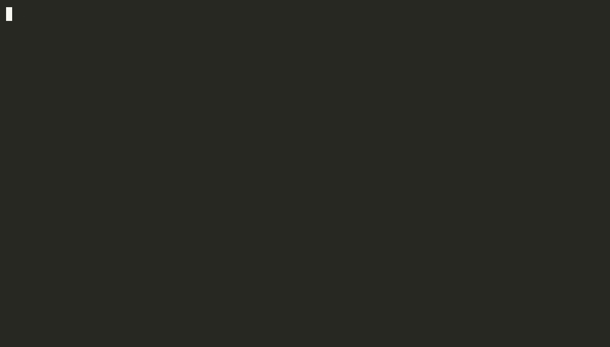

# Beseda

**Voice conversations with your coding agent.** Say “Alice, …” (in Russian, “Вика, …”) and talk to an AI agent in English or Russian, right
from the terminal: speech recognition and synthesis run locally on your Mac, the agent works in the current folder.

[Русская версия](README.ru.md)



▶ [The same conversation with sound (MP4)](docs/demo-en.mp4) ([Russian](docs/demo-ru.mp4)). The user's phrases are spoken by a second Silero voice
instead of a microphone; recognition, the pi agent and the answers are the real app. Long waits in the GIF are shortened.

```
microphone → Silero VAD + whisper.cpp (local) → brain: pi agent or DeepSeek → TTS: Silero (local) → speakers
```

> **Status:** alpha. macOS on Apple Silicon only. Russian (default) and English; more languages are a TOML file away.

## Features

- **Wake word, like a smart speaker.** Only phrases addressed to «Вика» reach the model; after an answer you can
  keep talking without the wake word, «стоп» ends the conversation, «подожди» gives you time to think.
- **Local speech.** whisper.cpp on the Mac GPU (Metal) for recognition, Silero for synthesis: from the
  first word of the answer to sound in 0.1–0.25 s.
- **Pluggable brains.** The [pi](https://www.npmjs.com/package/@earendil-works/pi-coding-agent) coding agent
  (reads and edits files, runs commands) or a plain DeepSeek chat; adding Claude or Codex is one class.
- **Observability.** Every session writes a log with a per-turn latency timeline: recognition, first token,
  first audio, tool calls.
- **Dialog recording.** The whole conversation as one WAV, with the real pauses.

## Requirements

- macOS on Apple Silicon, Python 3.12+, [uv](https://docs.astral.sh/uv/), `brew install portaudio`
- For `--tts edge`: `brew install ffmpeg`
- For the default brain: `npm install -g @earendil-works/pi-coding-agent` with a DeepSeek key configured in pi.
  For `--brain deepseek`: the `DEEPSEEK_API_KEY` environment variable.

## Install

```bash
brew install portaudio
uv tool install git+https://github.com/mikhail-angelov/beseda
```

Models download on first launch into `~/.beseda/models/` (Whisper small ~490 MB, Silero ~145 MB, VAD ~1 MB).

## Use

```bash
cd ~/some/project   # the agent works in the current folder
beseda                      # Russian
beseda --language en        # English
```

The table shows the Russian phrases; the English pack has its own (“Alice, …”, “hold on”, “that's all”).

| You say | What happens |
|---|---|
| «Вика, какая погода?» | Conversation starts (Tink sound); «какая погода?» goes to the model |
| «Вика» | A beep, then it waits for the request |
| anything, within `--follow-up` s after an answer (8 s) | Goes to the model without the wake word; the status line counts down |
| «Подожди», «дай подумать», «секунду» | Not sent to the model; the wait extends to `--hold` s (2 min) |
| «Стоп», «хватит», «спасибо, всё», or silence | Conversation ends (Bottle sound); the wake word is needed again |
| anything else without the wake word | Ignored, shown dimmed |

Keys: **Space** turns the microphone on/off, **Esc** interrupts the answer, **q** quits.

The microphone is off while the assistant speaks, so it never hears itself; interrupting by voice isn't
supported yet. The macOS microphone indicator stays on while Beseda runs: the stream must stay open to hear
the wake word.

## Configuration

Any option can be set in `~/.beseda/config.toml`; command-line flags win.

```toml
language = "ru"           # ru | en | your own pack
brain = "pi"              # pi | deepseek
model = "deepseek/deepseek-v4-flash"
whisper = "small"         # small | turbo
vocabulary = ["JavaScript", "DeepSeek"]
tts = "silero"            # silero | edge | say
voice = "baya"
wake-word = "вика"        # default comes from the language pack; "" answers everything
follow-up = 8
hold = 120
record = true             # or a file path
log-days = 14
```

See `beseda --help` for the full list.

## Languages

Everything that depends on the spoken language lives in a language pack, a TOML file: Whisper's language and
style prompt, the voice prompt for the model, the wake word and its grammatical endings, stop and hold phrases,
default TTS voices and the Silero model, and the terminal UI strings.

Built-in packs: [`ru`](beseda/languages/ru.toml) (default) and [`en`](beseda/languages/en.toml). To change a pack
or add a language, put a file into `~/.beseda/languages/`: `ru.toml` there overrides the built-in one, `de.toml`
adds German (`beseda --language de`). Copy a built-in pack as a starting point; every key is required.

## Speech recognition

Techniques carried over from [Vadic](https://github.com/mikhail-angelov/vadic) and checked on real dialogs:
loudness normalization before recognition, Whisper's own VAD (without it a cough becomes «Спасибо.», which is a
stop phrase), a style prompt for punctuation plus your `vocabulary` for terms, greedy decoding at temperature 0.

| `whisper` | Time per phrase (M1) | Notes |
|---|---|---|
| `small` (default) | ~0.5 s | Occasional wrong words |
| `turbo` (large-v3-turbo-q5_0) | ~2.1 s | Far more accurate; 574 MB |

Models other apps already downloaded (VoiceInk, Vadic) are reused.

## Speech synthesis

| `tts` | Russian voices | English voices | Runs | Per sentence (ru) | CPU per second of speech | RAM |
|---|---|---|---|---|---|---|
| `silero` (default) | xenia, baya, kseniya, aidar, eugene | en_0 … en_4 | locally | 0.04 s (en: ~0.35 s) | 16 ms | ~760 MB |
| `say` | Milena | Daniel | locally (macOS) | 0.6 s | 140 ms | ~40 MB |
| `edge` (experimental) | ru-RU-SvetlanaNeural, ru-RU-DmitryNeural | en-US-AriaNeural, en-US-GuyNeural | Microsoft cloud | 1–2 s | 60 ms | ~55 MB |

Silero's Russian model skips digits and Latin letters, so the Russian voice prompt asks the model to write numbers
and names in Russian words. Compare the voices by ear: `beseda-samples [--language en]` writes the same phrase in
every voice to `~/Downloads/beseda-tts-samples/`.

## Logs and recordings

Each session logs to `~/.beseda/logs/beseda-<time>.log`; logs older than `log-days` are deleted on start.

```bash
grep summary ~/.beseda/logs/*.log | tail      # latency per turn: stt, llm_first_token, tts_first_audio, voice_to_voice
grep -E 'ERROR|WARNING' ~/.beseda/logs/*.log   # incidents
```

`--debug` adds every pi event. `--record` saves the dialog to `~/Downloads/beseda-<time>.wav` on exit.

## Security

With the default `pi` brain the agent has **full access**: it reads and writes files and runs shell commands in
the current folder, by voice. Recognition makes mistakes. Run Beseda only in folders where that is acceptable,
and keep them under version control.

## Privacy

- Recognition, synthesis with `silero` or `say`, logs and recordings stay on your Mac.
- What you say to the assistant (after the wake word) is sent to the LLM provider: DeepSeek by default.
- With `tts = "edge"` the answers are sent to Microsoft.
- Logs contain the full text of your dialogs, including phrases that weren't addressed to the assistant;
  they are kept for `log-days` days.

## Model licenses

Beseda's code is MIT, and no models are bundled: they download to your machine on first use.
- **Silero TTS** (default voice): [CC BY-NC-SA 4.0](https://github.com/snakers4/silero-models/blob/master/LICENSE),
  **non-commercial use only**. For commercial use pick `say` or `edge`, or obtain a license from Silero.
- **Whisper** models and the Silero VAD used by whisper.cpp: MIT.
- **Edge TTS** uses an unofficial endpoint of the Microsoft Edge read-aloud service and may stop working.

## Extending

- A brain (`beseda/brains.py`) yields `("text", …)`, `("tool", …)`, `("error", …)` events and supports `abort()`;
  register it in `BRAINS`.
- A TTS engine (`beseda/tts.py`) subclasses `PcmEngine` with `render(text) -> PCM`; register it in `TTS_ENGINES`
  and list its voices under `[voices]` in each language pack.
- A language is a TOML file, see [Languages](#languages).

## Development

```bash
uv sync
uv run pytest
uv tool install --editable .   # the beseda command picks up code changes
uv run python scripts/demo.py  # re-record docs/demo-ru.gif and .mp4; --language en for the English one (needs brew install agg ffmpeg)
```

## License

[MIT](LICENSE)
